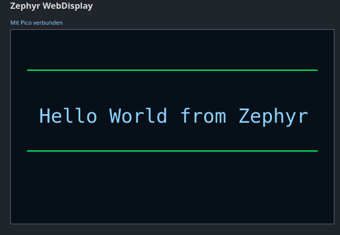
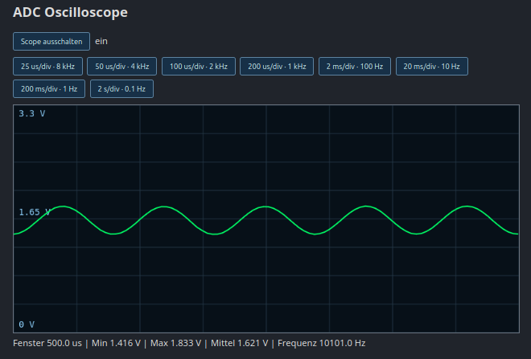
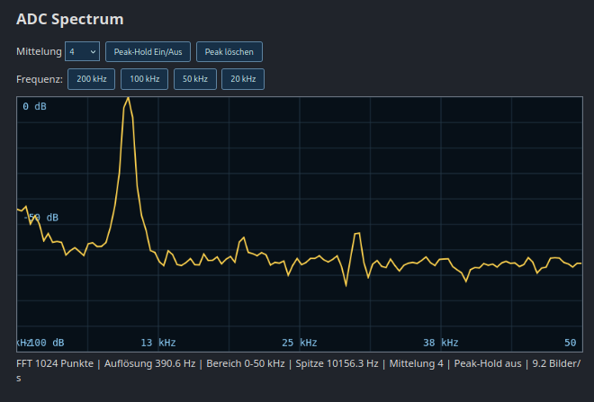
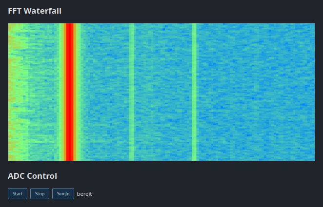
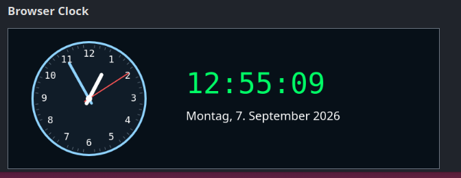

# Pico 2 W Zephyr WebScope

Webbasiertes Oszilloskop und Spektrumanalysator für den Raspberry Pi Pico 2 W
mit Zephyr RTOS. Der Pico erfasst das Analogsignal per ADC und DMA. Firefox oder
ein anderer moderner Browser übernimmt die grafische Darstellung mit HTML5
Canvas sowie die FFT-Berechnung in JavaScript.

Aktueller stabiler Stand: **Firmware 0.2.2**

## Funktionen

- Raspberry Pi Pico 2 W / RP2350
- Zephyr RTOS 4.4.x
- ADC0 an GP26
- 400.000 Samples/s
- DMA-Blöcke mit 1024 Samples
- Oszilloskop im Browser
- Zeitbasen von 25 µs/div bis 2 s/div
- FFT mit 20, 50, 100 und 200 kHz Darstellungsbereich
- FFT-Mittelung und Peak-Hold
- laufender Wasserfall
- gemeinsamer Binärstream für Scope und FFT
- Zephyr-Shell über USB CDC ACM
- automatische Verbindung mit gespeicherten WLAN-Zugangsdaten
- System- und Stackanalyse über die Shell

## Bildschirmansichten

### WebDisplay



Die allgemeine WebDisplay-Fläche demonstriert das Grundprinzip des Projekts:
Der Pico übermittelt einfache Zeichen- und Textinformationen, während der
Browser die eigentliche Grafik auf einem HTML5-Canvas rendert. Damit wird kein
Framebuffer und kein TFT-Grafikcontroller am Mikrocontroller benötigt.

### ADC-Oszilloskop



Das Oszilloskop stellt die von ADC0 an GP26 erfasste Signalform dar. Neben dem
Kurvenverlauf zeigt die Oberfläche Zeitfenster, Minimum, Maximum, Mittelwert
und die erkannte Frequenz. Die Zeitbasis kann von schnellen Signalen bis zu
langsamen Verläufen umgeschaltet werden.

### ADC-Spektrum



Die FFT wird in JavaScript aus den binär übertragenen ADC-Zeitdaten berechnet.
Angezeigt werden Frequenzbereich, FFT-Länge, Bin-Auflösung, stärkste
Spektrallinie, Mittelung und Bildrate. Dadurch übernimmt der Browser den
rechenintensiven Teil der Spektraldarstellung.

### FFT-Wasserfall



Der Wasserfall ergänzt das momentane Spektrum um den zeitlichen Verlauf. Neue
FFT-Zeilen werden fortlaufend eingefügt. Dauerhafte Träger, wechselnde Signale
und kurzzeitige Bandaktivität lassen sich dadurch leichter erkennen als in
einer einzelnen Spektralkurve.

### Browser-Uhr



Die analoge und digitale Uhr wird vollständig im Browser erzeugt. Sie zeigt,
dass unabhängige Canvas-Flächen parallel laufen können, ohne den RP2350 mit
regelmäßigen Zeichenoperationen zu belasten.

## Konzept

Ein TFT ohne Grafikprozessor würde den Mikrocontroller mit Bildspeicher,
Linien, Schriften und laufenden Bildübertragungen belasten. Dieses Projekt
verlagert das Rendering in den Browser:

1. ADC und DMA erfassen die Messwerte auf dem Pico.
2. Die Firmware bereitet Scope- und FFT-Zeitdaten vor.
3. Ein kompakter Binärstream überträgt beide Pakettypen über TCP.
4. JavaScript berechnet die FFT und zeichnet Scope, Spektrum und Wasserfall.

Der Pico überträgt keine vollständigen Bildschirmbilder.

Weitere technische Einzelheiten stehen in
[docs/ARCHITECTURE.md](docs/ARCHITECTURE.md).

## Hardware

- Raspberry Pi Pico 2 W
- Analogsignal an GP26 / ADC0
- gemeinsame Masse zwischen Signalquelle und Pico
- Eingangsspannung ausschließlich innerhalb des zulässigen ADC-Bereichs
  von 0 bis 3,3 V

Der Pico-Eingang ist weder gegen Überspannung geschützt noch für negative
Spannungen geeignet. Für Messungen außerhalb von 0 bis 3,3 V ist ein passendes
Analog-Frontend erforderlich.

## Projektstruktur

```text
pico_web_scope/
├── CMakeLists.txt
├── app.overlay
├── prj.conf
├── src/
│   ├── main.c
│   ├── adc_dma.c
│   └── adc_dma.h
├── docs/
│   ├── ARCHITECTURE.md
│   └── TROUBLESHOOTING.md
├── CHANGELOG.md
├── LICENSE
└── README.md
```

## Voraussetzungen

- eingerichteter Zephyr-Workspace
- Python-Virtual-Environment des Workspaces
- Zephyr SDK
- `west`, CMake und Ninja
- Infineon-WHD-Firmwareblobs für den CYW43439
- Raspberry Pi Debug Probe oder UF2-Flashverfahren

Die hier getestete Boardbezeichnung lautet:

```text
rpi_pico2/rp2350a/m33/w
```

## Bauen

Aus dem Zephyr-Workspace:

```bash
cd /home/ulrich/Dokumente/zephyrproject
source .venv/bin/activate
source zephyr/zephyr-env.sh

west build -p always \
  -b rpi_pico2/rp2350a/m33/w \
  -d build \
  -S cdc-acm-console \
  apps/pico_web_scope
```

Das erzeugte Image liegt unter:

```text
build/zephyr/zephyr.hex
build/zephyr/zephyr.uf2
```

## Flashen

### UF2

Pico mit gedrückter BOOTSEL-Taste anschließen und anschließend:

```bash
west flash -d build --runner uf2
```

### Raspberry Pi Debug Probe

Der OpenOCD-Aufruf muss die RP2350-Skripte einer OpenOCD-Version verwenden,
die `target/rp2350.cfg` enthält. Wichtig ist, das Image aus `build/` und nicht
aus einem alten Verzeichnis wie `build-ap/` zu flashen.

## WLAN einrichten

Über die USB-Shell verbinden und das WLAN einmalig konfigurieren. Beispiel für
WPA2-PSK:

```text
wifi connect -s "MEIN-WLAN" -p "MEIN-PASSWORT" -k 1
```

Die Firmware fordert beim Start die gespeicherte Verbindung an. Die vergebene
IP-Adresse zeigt:

```text
net iface
```

Statuskontrolle:

```text
wifi status
```

## Weboberfläche starten

Im Browser öffnen, wobei die IP-Adresse aus `net iface` verwendet wird:

```text
http://192.168.178.82:8080/
```

Danach die ADC-Erfassung über die Shell starten:

```text
adc start 1000000
```

Im Browser lassen sich Scope, Zeitbasis, FFT-Bereich, Mittelung und Peak-Hold
bedienen. Langsame Zeitbasen benötigen entsprechend mehr Zeit, bis ein
vollständiges Bild vorliegt.

## Shell-Befehle

Firmwareinformationen:

```text
info
```

ADC starten, stoppen und prüfen:

```text
adc start 1000000
adc stop
adc status
```

CPU- und Stackauslastung:

```text
system load
```

Netzwerkdiagnose:

```text
wifi status
net iface
```

## Binärstream

Der Browser öffnet einen dauerhaften Stream:

```text
GET /fft-stream?scope-step=8
```

Die 32 Byte großen Header beginnen mit einem Little-Endian-Magic-Wert:

| Magic | ASCII | Inhalt |
|---|---|---|
| `0x31544646` | `FFT1` | Zeitdaten für die FFT |
| `0x31504353` | `SCP1` | Scope-Daten und Messwerte |

FFT- und Scope-Pakete laufen über dieselbe TCP-Verbindung. Beim Wechsel der
Scope-Zeitbasis baut der Browser genau diesen Stream kontrolliert neu auf und
übergibt den neuen `scope-step` als URL-Parameter.

## Bekannte Grenzen

- maximal 400 kSamples/s und damit theoretisch 200 kHz Nyquist-Frequenz
- ADC-Eingang nur 0 bis 3,3 V
- kein kalibriertes Messgerät
- kein galvanisch getrennter Eingang
- kein SoftAP; der Pico arbeitet als WLAN-Station
- Browser und Pico müssen dasselbe Netzwerk erreichen können

## Lizenz

Siehe [LICENSE](LICENSE).
